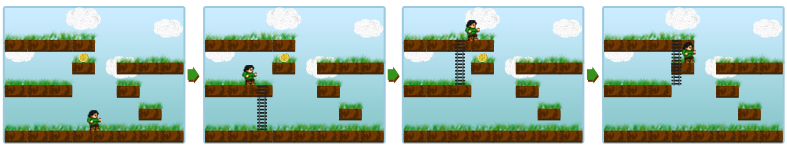

# [ArcadeManao](/tc?module=ProblemDetail&rd=15496&pm=12504)
*Single Round Match 576 Round 1 - Division I, Level One*

## Statement
You might remember the old computer arcade games. Here is one about Manao.

The game level is an NxM grid of equal cells. The bottom of some cells has a platform at which Manao can stand. All the cells in the bottommost row contain a platform, thus covering the whole ground of the level. The rows of the grid are numbered from 1 to N starting from the top and the columns are numbered from 1 to M starting from the left. Exactly one cell contains a coin and Manao needs to obtain it.

Initially, Manao is standing on the ground, i.e., in the bottommost row. He can move between two horizontally adjacent cells if both contain a platform. Also, Manao has a ladder which he can use to climb. He can use the ladder to climb both up and down. If the ladder is L units long, Manao can climb between two cells (i1, j) and (i2, j) if both contain a platform and |i1-i2| <= L. Note that Manao carries the ladder along, so he can use it multiple times. You need to determine the minimum ladder length L which is sufficient to acquire the coin.

Take a look at the following picture. On this level, Manao will manage to get the coin with a ladder of length 2.

You are given a int[] *level* containing N elements. The j-th character in the i-th row of *level* is 'X' if cell (i+1, j+1) contains a platform and '.' otherwise. You are also given ints *coinRow* and *coinColumn*. The coin which Manao seeks is located in cell (*coinRow*, *coinColumn*) and it is guaranteed that this cell contains a platform.

Return the minimum L such that ladder of length L is enough to get the coin. If Manao can perform the task without using the ladder, return 0.

## Definitions
- *Class*: `ArcadeManao`
- *Method*: `shortestLadder`
- *Parameters*: `String[], int, int`
- *Returns*: `int`
- *Method signature*: `int shortestLadder(String[] level, int coinRow, int coinColumn)`

## Notes
- Manao is not allowed to fall. The only way in which he may change his vertical coordinate is by using the ladder.

## Constraints
- *level* will contain N elements, where N is between 1 and 50, inclusive.
- Each element of *level* will be M characters long, where M is between 1 and 50, inclusive.
- Each element of *level* will consist of '.' and 'X' characters only.
- The last element of *level* will be entirely filled with 'X'.
- *coinRow* will be between 1 and N, inclusive.
- *coinColumn* will be between 1 and M, inclusive.
- *level*[*coinRow* - 1][*coinColumn* - 1] will be 'X'.

## Examples
### Example 1
#### Input
<c>["XXXX....",  "...X.XXX",  "XXX..X..",  "......X.",  "XXXXXXXX"], 2, 4</c>
#### Output
<c>2</c>
#### Reason
The example from the problem statement.

### Example 2
#### Input
<c>["XXXX",  "...X",  "XXXX"], 1, 1</c>
#### Output
<c>1</c>
#### Reason
Manao can use the ladder to climb from the ground to cell (2, 4), then to cell (1, 4) and then he can walk right to the coin.

### Example 3
#### Input
<c>["..X..",  ".X.X.",  "X...X",  ".X.X.",  "..X..",  "XXXXX"], 1, 3</c>
#### Output
<c>4</c>
#### Reason
With a ladder of length 4, Manao can first climb to cell (5, 3) and then right to (1, 3).

### Example 4
#### Input
<c>["X"], 1, 1</c>
#### Output
<c>0</c>
#### Reason
Manao begins in the same cell as the coin.

### Example 5
#### Input
<c>["XXXXXXXXXX",  "...X......",  "XXX.......",  "X.....XXXX",  "..XXXXX..X",  ".........X",  ".........X",  "XXXXXXXXXX"], 1, 1</c>
#### Output
<c>2</c>

