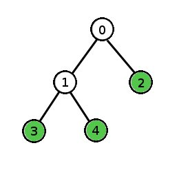
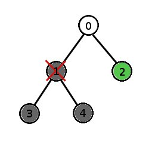

# [CellRemoval](/tc?module=ProblemDetail&rd=13697&pm=10275)
*Single Round Match 435 Round 1 - Division I, Level One*

## Statement
In biology, organisms have the following property: Starting from the first cell (the zygote), each cell during an organism's development process either divides into 2 other cells or does not divide at all.  An organism is mature when all of its cells will not divide any further.

Let's assign a unique number to each cell in an organism's development process.  For example, consider a species in which each organism starts with cell 0, which divides into cells 1 and 2.  Cell 1 divides into cells 3 and 4.  Cells 2, 3 and 4 do not divide.  Every mature organism of this species will consist of exactly 3 cells - 2, 3 and 4.

During the development process, if we kill a cell, it will be absent in the mature form of the organism.  If that cell happens to be a cell that divides, then the mature organism will be missing all of the cell's descendants as well because the cell is killed before it has a chance to divide.  For example, in the organism described above, if we kill cell 1 during the development process, the mature organism will contain only cell 2.

You are given a int[] *parentCell* describing the development process of an organism.  The i-th element of *parentCell* is the parent cell of cell i (where i is a 0-based index).  The zygote's parent is -1.  Return the number of cells the mature form of this organism would have if you killed cell *deletedCell* during the development process.

## Definitions
- *Class*: `CellRemoval`
- *Method*: `cellsLeft`
- *Parameters*: `int[], int`
- *Returns*: `int`
- *Method signature*: `int cellsLeft(int[] parent, int deletedCell)`

## Constraints
- *parentCell* will contain exactly N elements, where N is an odd integer between 1 and 50, inclusive.
- There will be exactly one "-1" element in *parentCell*.
- Every element of *parentCell* will be between -1 and N-1, inclusive.
- *parentCell* will form a binary tree.
- *deletedCell* will be between 0 and N-1, inclusive.

## Examples
### Example 1
#### Input
<c>[-1,0,0,1,1], 2</c>
#### Output
<c>2</c>
#### Reason
This is the example organism from the problem statement.  If we kill cell 2, there will still be two cells left (3 and 4).

### Example 2
#### Input
<c>[-1,0,0,1,1], 1</c>
#### Output
<c>1</c>
#### Reason
This is the example organism from the problem statement.  If we kill cell 1, the only cell left will be cell 2.  Cells 3 and 4 will not exist because cell 1 is their ancestor.

### Example 3
#### Input
<c>[-1,0,0,1,1], 0</c>
#### Output
<c>0</c>
#### Reason
If we kill the zygote, there is nothing left.

### Example 4
#### Input
<c>[-1,0,0,2,2,4,4,6,6], 4</c>
#### Output
<c>2</c>
### Example 5
#### Input
<c>[26,2,32,36,40,19,43,24,30,13,21,14,24,21,19,4,30,10,44,12,7,32,17,43,  35,18,7,36,10,16,5,38,35,4,13,-1,16,26,1,12,2,5,18,40,1,17,38,44,14], 24</c>
#### Output
<c>14</c>

