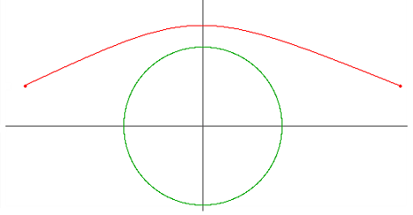
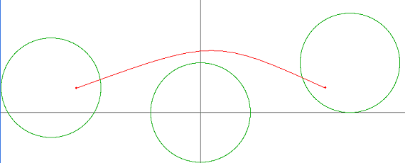
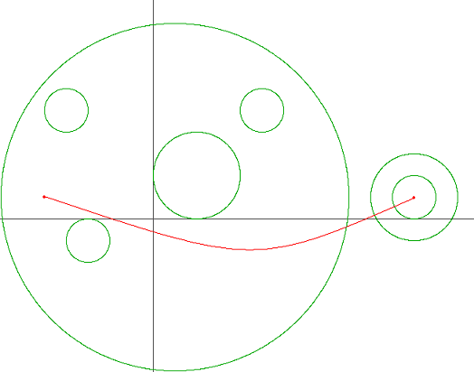
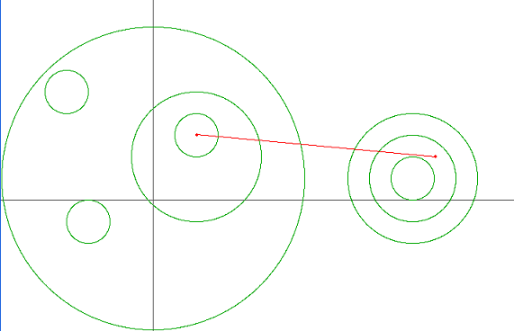

# [CirclesCountry](/tc?module=ProblemDetail&rd=13751&pm=10297)
*Single Round Match 443 Round 1 - Division I, Level One*

## Statement
Circles Country is a country that contains several circular-shaped districts.  Some districts may be situated inside other districts, but their borders do not intersect or touch.  Qatam is a resident of Circles Country.  When he travels between two locations, he always tries to cross the fewest number of district borders as possible because crossing borders is usually a laborious task.

Imagine Circles Country as an infinite plane.  You are given int[]s *X*, *Y* and *R*, where (*X*[i], *Y*[i]) are the coordinates of the i-th district's center and *R*[i] is its radius.  Qatam is currently at point (*x1*,*y1*) and he needs to get to point (*x2*,*y2*).  Neither of these points lies on a district border.  Return the minimal number of district borders he must cross to get to his destination.

## Definitions
- *Class*: `CirclesCountry`
- *Method*: `leastBorders`
- *Parameters*: `int[], int[], int[], int, int, int, int`
- *Returns*: `int`
- *Method signature*: `int leastBorders(int[] X, int[] Y, int[] R, int x1, int y1, int x2, int y2)`

## Constraints
- *X* will contain between 1 and 50 elements, inclusive.
- *X*, *Y* and *R* will each contain the same number of elements.
- Each element of *X* and *Y* will be between -1000 and 1000, inclusive.
- Each element of *R* will be between 1 and 1000, inclusive.
- *x1*, *y1*, *x2* and *y2* will be between -1000 and 1000, inclusive.
- No two circumferences will have common points.
- The points (*x1*,*y1*) and (*x2*,*y2*) will not lie on any of the circumferences.

## Examples
### Example 1
#### Input
<c>[0], [0], [2], -5, 1, 5, 1</c>
#### Output
<c>0</c>
#### Reason

### Example 2
#### Input
<c>[0,-6,6], [0,1,2], [2,2,2], -5, 1, 5, 1</c>
#### Output
<c>2</c>
#### Reason

### Example 3
#### Input
<c>[1,-3,2,5,-4,12,12], [1,-1,2,5,5,1,1], [8,1,2,1,1,1,2], -5, 1, 12, 1</c>
#### Output
<c>3</c>
#### Reason

### Example 4
#### Input
<c>[-3,2,2,0,-4,12,12,12], [-1,2,3,1,5,1,1,1], [1,3,1,7,1,1,2,3], 2, 3, 13, 2</c>
#### Output
<c>5</c>
#### Reason

### Example 5
#### Input
<c>[-107,-38,140,148,-198,172,-179,148,176,153,-56,-187], [175,-115,23,-2,-49,-151,-52,42,0,68,109,-174], [135,42,70,39,89,39,43,150,10,120,16,8], 102, 16, 19, -108</c>
#### Output
<c>3</c>

