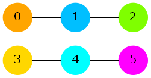

# [Fragile2](/tc?module=ProblemDetail&rd=16312&pm=13648)
*Single Round Match 648 Round 1 - Division II, Level Two*

## Statement
Lun the dog has found an undirected graph in Shuseki Forest. The graph consisted of N vertices and some edges. The vertices of the graph were numbered 0 through N-1. Each edge connected a different pair of vertices.

You are given the description of the graph in a String[] *graph* with N elements, each containing N characters. For each i and j, *graph*[i][j] will be 'Y' if vertex i and vertex j are connected by an edge, and 'N' otherwise. (Note that for each i, *graph*[i][i] will be 'N': there are no self-loops.)

Lun is interested in articulation pairs in this graph. An articulation pair is an unordered pair of two different vertices whose deletion increases the number of connected components in the graph. (The deletion of a vertex also removes all edges incident with that vertex.)

Return the number of the articulation pairs in Lun's graph.

## Definitions
- *Class*: `Fragile2`
- *Method*: `countPairs`
- *Parameters*: `String[]`
- *Returns*: `int`
- *Method signature*: `int countPairs(String[] graph)`

## Notes
- You are not given the value of N explicitly, but you can determine it as the number of elements in *graph*.
- Two vertices belong to the same connected component if and only if we can reach one of them from the other by following a sequence of zero or more edges.

## Constraints
- *graph* will contain between 3 and 20 elements, inclusive.
- Each element of *graph* will contain N characters, where N is the number of the elements in *graph*.
- Each character of each element of *graph* will be either 'Y' or 'N'.
- For each valid i and j, *graph*[i][j] will be equal to *graph*[j][i].
- For each valid i, *graph*[i][i] will be 'N'.

## Examples
### Example 1
#### Input
<c>["NYNN", "YNYN", "NYNY", "NNYN"]</c>
#### Output
<c>3</c>
#### Reason
The graph looks as follows:

The articulation pairs are (0, 2), (1, 2) and (1, 3).

For example, here is why (0, 2) is an articulation pair:
Currently there is one connected component.
(It contains all four vertices.)
If we remove the vertices 0 and 2, and all edges incident to these vertices, we will be left with two isolated vertices: 1 and 3.
Each of these vertices now forms a different connected component, so the number of connected components increased from 1 to 2.

### Example 2
#### Input
<c>["NYNNNN", "YNYNNN", "NYNNNN", "NNNNYN", "NNNYNY", "NNNNYN"]</c>
#### Output
<c>5</c>
#### Reason

The articulation pairs are (0, 4), (1, 3), (1, 4), (1, 5) and (2, 4).

### Example 3
#### Input
<c>["NNN", "NNN", "NNN"]</c>
#### Output
<c>0</c>
#### Reason

There are no articulation pairs.

### Example 4
#### Input
<c>["NYNYNNYYNN", "YNNNYNYYNN", "NNNNYNNNYN", "YNNNYYNNNN", "NYYYNNNNYN",  "NNNYNNNNYN", "YYNNNNNNNN", "YYNNNNNNYN", "NNYNYYNYNY", "NNNNNNNNYN"]</c>
#### Output
<c>9</c>
### Example 5
#### Input
<c>["NNNYNNYNNNNNNNYYNNNY", "NNNNNNNNYNNNNNNNNNNN", "NNNNNNNNNNNNNNNNNNNN", "YNNNNNNNNNYNNNNNNNNN", "NNNNNNNYNNNNNYNNNNYN",  "NNNNNNNNNNNNNNNNYNNY", "YNNNNNNNNNNNNYYYNYNN", "NNNNYNNNNNNNNYYNNNNN", "NYNNNNNNNYNNNNNNNNNN", "NNNNNNNNYNNNYNNNNNYN",  "NNNYNNNNNNNNNNYNNNNN", "NNNNNNNNNNNNNNNNNNNN", "NNNNNNNNNYNNNNNNNYNN", "NNNNYNYYNNNNNNNNNNNN", "YNNNNNYYNNYNNNNNNNNN",  "YNNNNNYNNNNNNNNNYNNN", "NNNNNYNNNNNNNNNYNYNN", "NNNNNNYNNNNNYNNNYNNN", "NNNNYNNNNYNNNNNNNNNN", "YNNNNYNNNNNNNNNNNNNN"]</c>
#### Output
<c>42</c>

